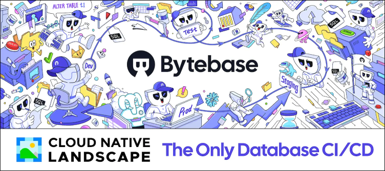

# Bytebase CI/CD pipeline

Deploy Bytebase server with CI/CD on Elestio

 
 

# Once deployed ...

You will need to register to create an admin account

# SMTP

To configure the SMTP server, you will need to click on the Settings tab at the top, and on the left side, on Mail delivery.

this step will be done twice,

the first time fill in the following information:

        SMTP Server Host: 172.17.0.1
        SMTP Server Port: 25
        From: [DOMAIN]@vm.elestio.app

        Authentication Method: LOGIN

        SMTP Username: root
        SMTP Password: [ADMIN_PASSWORD]

        Encryption: NONE

Save, and immediately change

        Authentication Method to NONE

Save again, your SMTP server is configured
